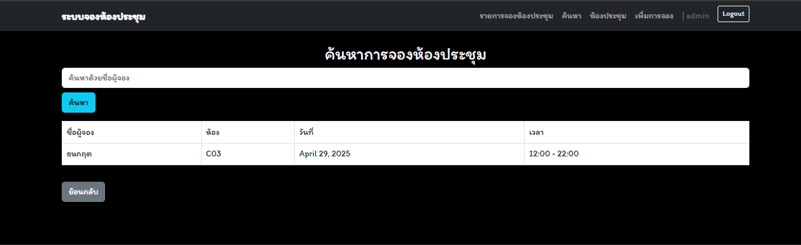
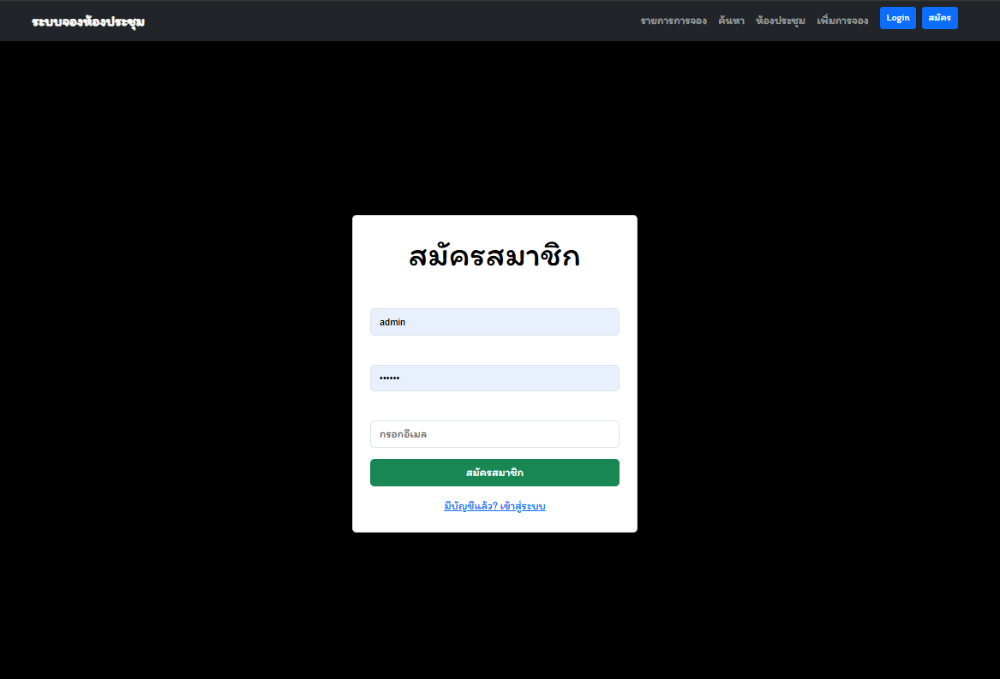
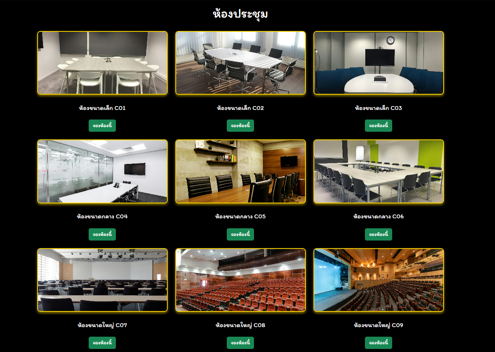

# 🏢 Meeting_Room

เว็บสำหรับจองห้องประชุม พร้อมระบบแสดงข้อมูลการจอง ค้นหา แก้ไข และยกเลิกการจองตามสิทธิ์ของผู้ใช้งาน

---

## 🚀 Features
ระบบแสดงข้อมูลการจอง ค้นหา แก้ไข และยกเลิก การจองห้องประชุมตามสิทธิ์ของผู้ใช้งานตัวอย่างเว็บ

## 📦 Installation

### 1. Clone โปรเจกต์
https://github.com/nonzawoy6440/Project-Meeting-room.git
### 2. รัน Development Server
python manage.py runserver
### ก่อนเข้าสู่ระบบ (Guest)

❌ ไม่สามารถดูรายละเอียดรายการจองห้องประชุม
❌ ไม่สามารถจอง แก้ไข หรือยกเลิกการจอง
❌ ไม่สามารถเลือกขนาดห้องประชุมที่ต้องการได้ (ต้องเข้าสู่ระบบก่อน)  

  
✅ สามารถค้นหาข้อมูลการจองห้องประชุมได้  

  
📝 สมัครสมาชิกเพื่อใช้งานเต็มรูปแบบ  
 
  

---

### หลังเข้าสู่ระบบหรือสมัครสมาชิก (Authenticated User)
🔐 หน้า Login  
 
  

✅ ดูรายละเอียดรายการจองห้องประชุมทั้งหมด  
🔁 แก้ไข และยกเลิกการจองได้  
 
  

➕ แบบฟอร์มเพิ่มข้อมูลการจองห้องประชุม  

  
🔍 ค้นหาการจองห้องประชุม  
 
  
🏠 เลือกขนาดห้องประชุมที่ต้องการได้  
 
  

---

## 🛠 Technologies

Python
Django
HTML / CSS / JavaScript
SQLite (ค่าเริ่มต้นของ Django)
manage.py
